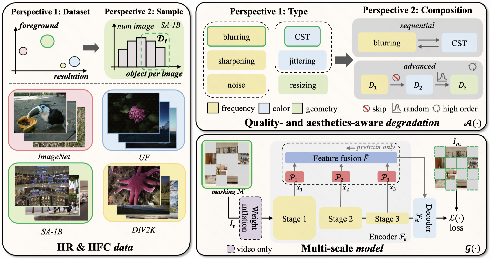

# [ACM MM 2024] QPT V2: Masked Image Modeling Advances Visual Scoring

[Arxiv](https://arxiv.org/abs/2407.16541)
<a href='https://arxiv.org/abs/2407.16541'></a> &nbsp;&nbsp;

Qizhi Xie<sup>1,2</sup> | Kun Yuan<sup>2</sup> | Yunpeng Qu<sup>1,2</sup> | Mingda Wu<sup>2</sup> | Ming Sun<sup>2</sup> | Chao Zhou<sup>2</sup> | Jihong Zhu<sup>1</sup>

<sup>1</sup>Tsinghua University, <sup>2</sup>Kuaishou Technology.

## 👁️ Overview

Quality assessment and aesthetics assessment aim to evaluate the perceived quality and aesthetics of visual content. Current learning-based methods suffer greatly from the scarcity of labeled data and usually perform sub-optimally in terms of generalization. Although masked image modeling (MIM) has achieved noteworthy advancements across various high-level tasks (_e.g._, classification, detection _etc._). In this work, we take on a novel perspective to investigate its capabilities in terms of _quality- and aesthetics-awareness_. To this end, we propose **Q**uality- and aesthetics-aware **P**re**T**raining (QPT V2), the first pretraining framework based on MIM that offers a unified solution to quality and aesthetics assessment. To perceive the high-level semantics and fine-grained details, pretraining **data** is curated. To comprehensively encompass quality- and aesthetics-related factors, **degradation** is introduced. To capture multi-scale quality and aesthetic information, **model** structure is modified. Extensive experimental results on 11 downstream benchmarks clearly show the superior performance of QPT V2 in comparison with current state-of-the-art approaches and other pretraining paradigms.


## 📜 Updates

**[2024/7/16]** QPT V2 was accepted by ACM MM 2024!

## 👨‍💻 Todo

- [x] Checkpoints of QPT V2, including IQA & VQA & IAA.
- [] Inference code of QPT V2.
- [] Training code of QPT V2.

## ✒️ Citation

If you find our work helpful for your research, please consider giving a star ⭐ and a citation 📝

```bibtex

@inproceedings{qpt,
  author       = {Kai Zhao and
                  Kun Yuan and
                  Ming Sun and
                  Mading Li and
                  Xing Wen},
  title        = {Quality-aware Pretrained Models for Blind Image Quality Assessment},
  booktitle    = {{CVPR}},
  pages        = {22302--22313},
  publisher    = {{IEEE}},
  year         = {2023}
}

@inproceedings{qptv2,
  author       = {Qizhi Xie and
                  Kun Yuan and
                  Yunpeng Qu and
                  Mingda Wu and
                  Ming Sun and
                  Chao Zhou and
                  Jihong Zhu},
  title        = {{QPT-V2:} Masked Image Modeling Advances Visual Scoring},
  booktitle    = {{ACM} Multimedia},
  pages        = {2709--2718},
  publisher    = {{ACM}},
  year         = {2024}
}
```
